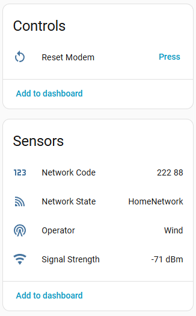

# SMS Gammu Gateway - Home Assistant Integration


## 🚀 Introduction
This custom integration allows **Home Assistant** to communicate with a local SMS Gateway based on Gammu. It connects to the REST API provided by the **SMS Gammu Gateway** software to monitor signal strength, network status, send SMS messages, and receive incoming SMS via polling.

It is designed to be fully configurable via the Home Assistant UI.

## ⚠️ Prerequisites
**IMPORTANT**: This integration **is not standalone**. It requires the **SMS Gammu Gateway** software to be installed and running on a device in your network (e.g., via Docker or directly on a Raspberry Pi with a USB modem).

You **must** have this software running first:
👉 **[pajikos/sms-gammu-gateway on GitHub](https://github.com/pajikos/sms-gammu-gateway)**

Ensure that:
1. The gateway is reachable via IP address.
2. The REST API is active (usually on port 5000).
3. You have the `username` and `password` configured in the gateway (Defaults: `admin`/`password`).

## ✨ Features
- **Signal Monitoring**: Real-time sensor for signal strength (dBm).
- **Network Info**: Sensors for Network Operator, Network State, and Network Code.
- **Send SMS**: A dedicated service (`gammu_gateway.send_sms`) to send text messages from HA.
- **Receive SMS**: Polls the gateway for new messages and fires a Home Assistant event (`gammu_gateway_sms_received`).
- **Modem Control**: A dedicated button entity to **Reset** the modem remotely.
- **Configurable Intervals**: Set independent update intervals for Signal/Network data and SMS checking.
- **UI Configuration**: Fully managed via Config Flow (Settings -> Devices & Services).

## 🖼 Screenshots


## 🛠 Installation

### 1️⃣ Install via HACS (Recommended)
1. Open Home Assistant and ensure [HACS](https://hacs.xyz/) is installed.
2. Go to **HACS** → **Integrations** → **Top Right Menu** → **Custom Repositories**.
3. Enter the URL of this repository.
4. Select **Integration** as the category and click **Add**.
5. Click **Install** and restart Home Assistant.
6. Navigate to **Settings** → **Devices & Services** → **Add Integration** → Search for **SMS Gammu Gateway**.

### 2️⃣ Manual Installation
1. Download the latest release or clone this repository.
2. Copy the `custom_components/gammu_gateway` folder into your Home Assistant's `config/custom_components/` directory.
3. Restart Home Assistant.
4. Add the integration via **Settings** → **Devices & Services** → **Add Integration** → Search for **SMS Gammu Gateway**.

## ⚙️ Configuration
During the setup via UI, you will be asked for:
* **Host**: The IP address of the machine running `sms-gammu-gateway`.
* **Port**: The API port (Default: `5000`).
* **Username**: API Username (Default: `admin`).
* **Password**: API Password (Default: `password`).
* **Signal Scan Interval**: How often to update signal/network sensors (in seconds).
* **SMS Check Interval**: How often to poll for new messages (minimum 10 seconds).

## 📖 Usage

### Sending SMS
You can use the `gammu_gateway.send_sms` service in your scripts or automations:

```yaml
service: gammu_gateway.send_sms
data:
  number: "+393331234567"
  message: "Alert! The alarm has been triggered."
```

### Receiving SMS (Automation)
The integration fires an event when a new SMS is detected. You can catch this event in an automation:

```yaml
alias: "Notify on SMS Received"
trigger:
  - platform: event
    event_type: gammu_gateway_sms_received
action:
  - service: notify.mobile_app_your_phone
    data:
      title: "New SMS from {{ trigger.event.data.sender }}"
      message: "{{ trigger.event.data.text }}"
```

## 🤝 Contributing
We welcome contributions! Feel free to open issues, suggest features, or submit pull requests.
- **Feature Requests**: Open an issue describing your idea.
- **Bug Reports**: Report bugs with clear steps to reproduce them.
- **Code Contributions**: Fork the repo, create a new branch, and submit a pull request.
- **Translations**: Translate the integration into your language.

## ☕ Support & Donations
If you find **Tado Assist** useful, consider buying me a coffee to support future development! 

[](https://ko-fi.com/array81)

## 📜 License
This project is licensed under the [MIT License](LICENSE).
  
### v1.0.0 - Initial Release
- First public version.

---
📢 **Stay updated!** Follow the project on GitHub for updates and new features.

